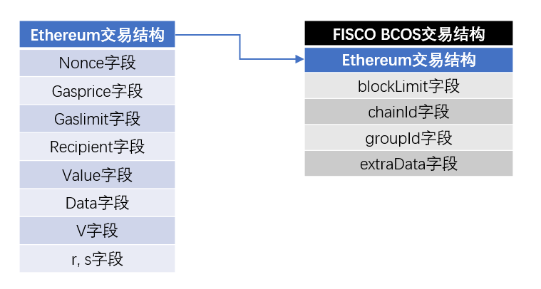
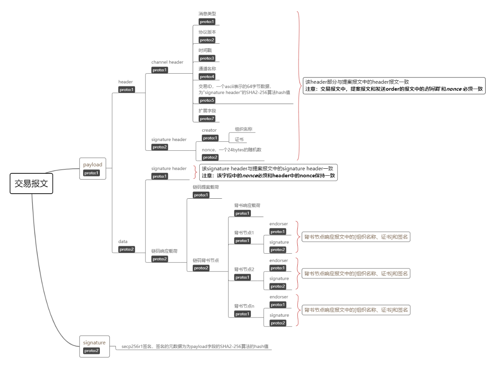
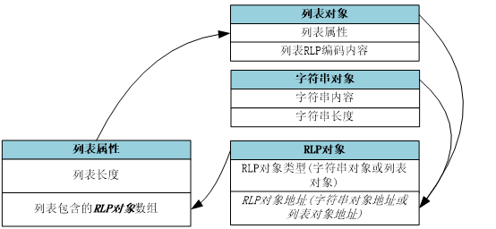
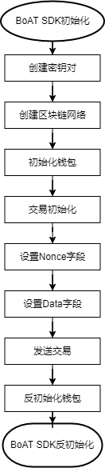

# BoAT Edge总体设计

## 引言

### 编写目的
本文对BoAT Edge（后文中简称 BoAT）的系统总体设计进行描述，包括体系架构设计、子系统功能、内外部接口、关键流程及关键技术设计描述，以期指导各子系统的总体设计及测试策略/规范的编写。  
本文的预期读者为：BoAT Edge相关设计人员。

### 缩写术语
|术语   |解释                         |
|:----- |:--------------------------- |
|ABI    |Application Binary Interface |
|BE     |BoAT-Engine                  |
|BIA    |BoAT Infra Arch              |
|BoAT   |Blockchain of AI Things      |
|BPT    |BoAT-ProjectTemplate         |
|BSL    |BoAT-SupportLayer            |
|RLP    |Recursive Length Prefix      |
|RNG    |Random Numeral Generator     |
|RPC    |Remote Procedure Call        |
|TEE    |Trusted Execution Environment|
|RAM    |Random Access Memory         |

## BOAT Edge设计目标
作为物联网区块链应用端侧产品，应以最小的改动代价，方便、快速的移植到各物联网设备中*~~模组~~*中，BOAT Edge的设计遵循以下原则:
+ 层次化设计  
+ 多个区块链协议支持  
+ 可扩展设计  
+ 密钥安全设计  
+ 针对不同区块链提供相应的C语言接口合约自动生成工具  

## BOAT Edge在整个区块链网络中的位置
BOAT Edge作为连接物联网设备和区块链的中间件，其在整个交互网络中的位置如图3-1所示。  
  
图 3-1 BoAT在区块链交互网络中的位置  

## BOAT Edge的实现框架  
BoAT Edge 提供的物联网区块链应用功能，由BoAT Infra Arch基础架构实现。BoAT Infra Arch基础架构是物联网区块链应用程序设计框架，通过分层设计将区块链应用和物联网平台分离，通过底层抽象将不同应用平台集成在统一的应用框架下，实现多种区块链支持和有效范围内的跨平台设计。  

  
图 4-1 BoAT Infar Arch基础架构图  
如图所示，BIA 基础架构分为四层结构，自顶向下分别为： 
 
+ Application layer：  
应用层，IoT Application，根据IoT设备应用场景需求，通过调用Composable BoAT Core层和BoAT Support Layer层API接口，设计实现Iot应用功能。  

+ Composable BoAT Core layer:   
可组合的BoAT核心层，BoAT的核心组件，这些组件可以组合部署，如图所示多个BoAT组件，其中虚线方框中的组件BoAT-Provisioner、BoAT-ATRelayer、BoAT-Lite为私有组件暂不开源如由需要可以联系我们，实线框中的BoAT-Engine组件为开源组件。  
  - BoAT Engine：为IoT应用提供基于BoAT-SuppotLayer设计的多链客户端API，应用层可以通过BoAT Engine的API接口实现IoT多区块链应用访问应用。  
  - BoAT Provisioner：为IoT设备提供初始密钥对管理接口，实现IoT设备的个人化功能。  
  - BoAT Lite：与BoAT Wake服务集成在一起的签名服务。  
  - BoAT AT Relayer：区块链AT命令扩展，为模组提供自定义AT指令定义和常规AT指令转发功能。  

+ BoAT Support Layer:    
BoAT支持层，包含操作系统和驱动程序抽象层，以及BoAT的通用组件。通过BoAT-SupportLayer的抽象，为应用层提供基于不同操作平台的通用API接口，使得BoAT Infra Arch基础架构在支持的操作平台（platform）之间实现应用层的跨平台应用。即IoT设备在更换BIA架构支持的硬件平台后，应用程序仅需选择适配的platform，重新编译后就可以在新的硬件环境中运行。   
  - OSAL：封装操作系统功能的抽象层，例如动态内存、任务、信号量、队列  
  - DAL：硬件驱动程序和模块扩展的抽象层，例如UART、虚拟AT  
  - BoAT通用组件：BoAT的通用库，例如区块链加密库、RLP编码、RPC服务、密钥对管理等。  

+ RTOS/Module OpenSDK Layer:   
操作系统/模组OpenSDK层，这一层是IoT设备的操作系统层，包括在MCU中采用的RTOS(linux、freeRTOS、Azure RTOS等)，或者由模块供应商提供的用于OpenCPU应用程序的SDK。除了Module Vendor Extensions（模组供应商扩展）之外，其他部分最初由芯片供应商提供。
  - HAL：硬件抽象层。
  - Driver Framework: 驱动程序框架，驱动程序管理和统一驱动程序接口的框架，例如read()、write()、ioctl()
  - Operating System：RTOS或Linux
  - System Common Libs.: 系统公共库，系统提供的常见库，例如C库、TLS库、MQTT/HTTP/TCP/IP库
  - Module Vendor Extensions:模组供应商扩展，模块供应商在芯片基础上的扩展功能，例如模块供应商特定的AT命令，在MCU应用中不包括这个模块

## BoAT-Engine和BoAT-SupportLayer  

BoAT Infra Arch基础框架目前实现两层开源组件：BoAT-SupportLayer和BoAT-Engine。  
实现的组件框架如图4-2所示： 

  
图 4-2 BoATInfraArch实现组件图  
BoAT-Engine，基于BoAT-SupportLayer实现多种区块链访问接口。  
BoAT-SupportLayer，提供操作系统API抽象、驱动抽象和常规通用组件接口，在BoAT Infra Arch支持的platform范围内提供跨平台设计特性。  
两层组件均遵循层次化设计，BoAT-Engine由Wallet钱包、Protocol区块链协议、Network区块链网络和Tools通用工具组成；BoAT-SupportLayer由OSAL、DAL和BoAT通用组件组成。各层具体功能如下：
+ BoAT-Engine:  
  - Wallet钱包： 提供物联网区块链应用钱包和对应的交易接口。
  - Protocol区块链协议： 主要实现各区块链协议接口。
  - Network区块链网络： 提供各区块链网络信息相关接口。
  - Tools通用工具： 用于智能合约的C语言接口生成。
+ BoAT-SupportLayer:  
  - BoAT Common Coponents：通用组件，向协议层提供RPC服务；为接口层的钱包提供密码学算法、签名、存储中间接口；向各层提供如数据格式转换和报文编解码等服务。  
  - OSAL：操作系统抽象层，将不同platform的系统API抽象为统一的通用接口，为上层应用跨平台设计提供服务。通用组件的实现依赖于相应平台的OSAL和DAL支持。  
  - DAL：驱动抽象层，将不同platform的驱动和特性功能抽象为统一的通用接口，为上层应用跨平台设计提供服务。  
  
### BoAT-Engine
#### 概述

BoAT-Engine位于区块链应用接口的最上层，向物联网应用提供访问各区块链的入口，BoAT-Engine包含以下接口组件：
+ Wallet钱包接口
  * 钱包接口是BoAT SDK的入口，不同的区块链有着相似的钱包入口。
  * 不同的区块链实现各自的钱包入口，以及相应的钱包交易，每个区块链都提供一套交易接口，其功能类似，具体实现有所不同。
+ Protocol区块链协议接口：  
  * 各区块链协议应用接口，不同区块链对用不同的协议接口。
+ Network区块链网络接口：   
  * 提供各区块链网络信息相关接口，包含区块链节点类型、链接方式、角色类型等区块链网络相关信息。
+ Tools通用工具接口：   
  * 用于智能合约的C语言接口生成。

BoAT-Engine的各个接口由BoAT-SupportLayer层提供支持，有关BoAT-SupportLayer层的描述请参见[BoAT-SupportLayer](#BoAT-SupportLayer)。  
 
BoAT-Engine详细构成如图4-3所示：

图 4-3 BoAT-Engine内部构成图
#### Wallet区块链钱包接口  
Wallet区块链钱包含两部分内容，钱包接口和交易接口，分别实现区块链钱包管理和区块链交易管理。  
##### 钱包接口
###### 钱包接口的数据结构和功能实现清单
钱包是一个容器，容器里除了存储着访问区块链所必须的信息，还包含了一个密钥对结构~~管理系统~~和**区块链网络信息结构**。

在钱包的数据结构中，应至少包含以下元素：
  + 账户私钥
  + 区块链网络信息

除必须包含的元素外，钱包的数据结构可选择包含：
  + 账户地址

钱包应当实现以下功能：  
  + BoAT-Engine初始化
  + BoAT-Engine反初始化
  + 钱包创建
  + 钱包删除
  
###### 钱包接口功能实现简述  
####### BoAT-Engine初始化/反初始化
+ BoAT-Engine初始化：  
在使用BoAT SDK之前应做BoAT-Engine初始化，该接口执行的内容包括：
  1. 全局资源初始化  
SDK使用的一些三方库如果在调用前需做一次初始化，则应放在此处执行初始化，如*协议*层使用的三方库cjson、curl等。  
+ SDK反初始化：  
在使用BoAT SDK结束后应做SDK反初始化释放资源，该接口执行的内容包括：  
  1. 全局资源反初始化  
SDK使用的一些三方库如果在调用前需做一次反初始化，则应放在此处执行反初始化，如*协议*层使用的三方库cjson、curl等。

####### 钱包操作
+ 钱包初始化：  
该接口用于实现一个新钱包的创建或一个已创建钱包的读取，该接口执行的内容包括：  
  1. 根据具体入参决定是创建新钱包还是读取已创建的钱包  
  2. 根据具体入参执行某一个区块链的钱包初始化，如执行Ethereum的钱包初始化，或者执行PlatONE的钱包初始化
+ 钱包反初始化
  释放钱包初始化过程中使用的系统资源。  
  
##### 交易接口
###### 钱包交易的数据结构和功能实现清单
交易是经过签名后的一条消息，通过区块链的网络传播，被记录在区块链上。不同的区块链提供的交易接口的功能基本一致。  

对于Ethereum/Polygon/PlatON/PlatONE/FISCO BCOS/Venachain：

交易应至少包含如下元素：
+ 钱包的数据结构
+ 交易标识
+ 交易所需的报文  

交易应提供以下功能实现：  
+ 钱包初始化
+ 钱包反初始化
+ 账户余额查询
+ 交易初始化
+ 发送交易
+ 查询交易回执
+ 无状态消息调用  
  
 

###### Ethereum/Polygon交易接口功能实现简述
+ 钱包初始化：  
  该接口执行的内容包括：
  1. 设置区块链合约地址
  2. 设置交易是否指定链ID
  3. 设置链ID
+ 钱包反初始化：  
  该接口执行的内容包括：
  1. 归零私钥信息
  2. 区块链网络信息资源释放
  3. 调用协议层提供的web3接口：web3接口反初始化
+ 账户余额查询：  
  该接口执行的内容包括：
  1. 准备账户余额查询所需的报文信息
  2. 调用协议层提供的web3接口：获取账户余额
+ 交易初始化：  
  该接口主要实现初始化交易结构中的字段。Ethereum的交易结构中除签名的v、r、s三个字段外，还有nonce、gasPrice、gasLimit、recipient、value、data等六个字段。请注意，交易的Nonce字段的设置并不在该接口中实现，而是放在交易发送时刻设置，因为用户可能同时创建多个交易报文，而这些报文被发送至区块链网络的顺序是不确定的。另外需要说明的是，Nonce和gasPrice字段宜通过调用协议层相应的web3接口从区块链获取，此种方式需要访问网络，会产生一定的网络流量。
  该接口执行的内容包括：
  1. 设置交易的GasPrice字段
  2. 设置交易的GasLimit字段
  3. 设置交易的Recipient字段
  4. 设置交易的Value字段
+ 发送交易  
  该接口执行的内容包括：  
  1. 判断发送同步/异步标识(如果有)
  2. 标识为同步发送：调用协议层提供的raw transaction接口：raw transaction同步发送
  3. 标识为异步发送：调用协议层提供的raw transaction接口：raw transaction异步发送
+ 查询交易回执：  
  该接口执行的内容包括：
  1. 准备查询交易回执所需的报文信息
  2. 每隔指定时间调用一次协议层提供的web3接口“获取交易回执”直至触发超时时间
  3. 返回查询结果
+ 发送Ether  
  该接口执行的内容包括：
  1. 设置交易的Nonce字段
  2. 设置交易的Value字段
  3. 设置交易的Data字段
  4. 执行发送交易
+ 无状态消息调用：  
  该接口执行的内容包括：  
  1. 准备无状态消息调用所需的报文信息  
  2. 调用协议层提供的web3接口“区块链无状态调用”  

###### PlatON交易接口功能实现简述
PlatON和Ethereum相比，差异主要集中在如下三点:  
  1. 双方地址不一样。  
    PlatON在以太坊的基础上，额外增加了一种类似Bitcoin的Bech32格式的地址。所以，在初始化交易时，除了以太坊需要的参数外，还需要额外设置地址的hrp(Human-readable parts)。钱包会在调用RPC时会自动使用指定的地址格式。  
  2. 通过RPC调用的函数名称不一样。  
    对BoAT SDK用户来说没有区别。  
  3. PlatON必须使用指定区块链ID方式。  
    EIP-155描述了两种可以用来交易的数据格式，但是PlatON只支持一种，具体参考[raw transaction接口简述](#raw-transaction接口简述)。   

在设计PlatON的数据结构及代码实现时，应考虑数据结构的继承及代码实现的复用，这样既减少代码量，也便于维护。尽管PlatON的交易结构和Ethereum一样，但是，在一些RPC命令中的调用时，需要用到Bech32格式的地址。因此，在数据结构的设计中，增加了两个存贮Bech32格式地址的字段，可能的设计思路如图4-4所示：  
  
图 4-4 PlatON数据结构的一种可能的设计思路  
图4-4描述了PlatON的一种可能的数据结构设计思路，请注意，PlatON的两个额外地址字段应放置在数据结构的最末位置，不能破坏复用的Ethereum的数据结构的完整性。如果破坏了Ethereum的数据结构的完整性，将导致Ethereum中与该数据结构相关的实现方法不可复用。  

###### PlatONE交易接口功能实现简述
和Ethereum相比，其有差异的地方列出如下：  
+ 交易初始化  
除了Ethereum描述的初始化步骤外，PlatONE还要：
  1. 设置交易类型字段  

由前所述可以看出，PlatONE和Ethereum的差异非常的小，在设计PlatONE的数据结构及代码实现时，应考虑数据结构的继承及代码实现的复用，这样既减少代码量，也便于维护。比如在交易结构上的组成上，PlatONE的交易结构比Ethereum的交易结构多了一个交易类型字段，因此，在数据结构的设计中，一种可能的设计思路如图4-5所示：  

图 4-5 PlatONE数据结构的一种可能的设计思路  
图4-5描述了PlatONE的一种可能的数据结构设计思路，请注意，PlatONE的交易类型字段应放置在数据结构的最末位置，不能破坏复用的Ethereum的数据结构的完整性。如果破坏了Ethereum的数据结构的完整性，将导致Ethereum中与该数据结构相关的实现方法不可复用。

###### FISCO BCOS交易接口功能实现简述
和Ethereum相比，有差异的地方可以参考FISCO BCOS官方文档 https://fisco-bcos-documentation.readthedocs.io/zh_CN/latest/docs/design/protocol_description.html 。  

在设计FISCO BCOS的数据结构及代码实现时，应考虑数据结构的继承及代码实现的复用，这样既减少代码量，也便于维护。在交易结构体中新增了以下四个字段：  
  1. blockLimit交易生命周期  
  2. chainId链信息  
  3. groupId群组ID  
  4. extraData预留字段  
因此，在数据结构的设计中，一种可能的设计思路如图4-6所示：  
  
图 4-6 FISCO BCOS数据结构的一种可能的设计思路  
图4-6描述了FISCO BCOS的一种可能的数据结构设计思路，请注意，FISCO BCOS的交易类型字段应放置在数据结构的最末位置，不能破坏复用的Ethereum的数据结构的完整性。如果破坏了Ethereum的数据结构的完整性，将导致Ethereum中与该数据结构相关的实现方法不可复用。

***注：由于FISCO BCOS在交易中增加了新的字段，所以进行RLP编码时和Ethereum并不一样。***  

###### Fabric交易接口功能实现简述
-	钱包初始化
  该接口执行的内容包括：
  1. 为钱包结构体申请空间。
  2. 设置账户的私钥路径/索引。
  3. 设置账户的证书。
  4. 如果需要支持TLS，则设置TLS验证服务端身份时要使用的根证书。
  5. 如果TLS需要支持双向认证，还应设置客户端的私钥路径/索引及相应证书。
  6. 设置节点信息，如背书节点和排序节点的数量，地址，主机名。如果启用了TLS，主机名字段将被用来做服务端身份的验证，它和服务端TLS证书中的CN字段保持一致；如果不启用TLS，主机名将被忽略。
  7. 初始化HTTP2环境。
-	钱包反初始化
  该接口执行的内容包括：
  1. 释放为账户私钥路径/索引及证书申请的空间。
  2. 释放为TLS客户端私钥路径/索引及证书申请的空间(如果启用了TLS)。
  3. 释放为根证书申请的空间(如果启用了TLS)。
  4. 释放为背书/排序节点信息申请的空间。
  5. 反初始化HTTP2环境。
  6. 释放为钱包结构体申请的空间。
-	交易初始化
  该接口执行的内容包括：
  1. 设置交易要访问的链码的属性：路径、名称、版本。
  2. 设置发起交易的客户端的通道名称。
  3. 设置发起交易的客户端的组织名称。
-	交易反初始化
  该接口执行的内容包括：
  1. 释放为链码属性申请的空间。
  2. 释放为通道名称申请的空间。
  3. 释放为组织名称申请的空间。
-	交易参数设置
  该接口执行的内容包括：
  1. 设置交易发起时刻的时间戳。
  2. 设置交易的参数。
-	发送交易
  该接口执行的内容包括：
  1. 发送查询相关的报文。
  2. 发送调用相关的报文。

  
### Network区块链网络接口
#### 概述  
区块链网络接口，是一组区块链网络相关的信息，这些信息用于构建区块链钱包，并在后续的区块链应用中作为连接区块链网络的参数。这些网络信息存放在IoT设备中，由于BoAT SDK运行在蜂窝模组的应用处理器上，其运行环境的资源是受限的，如有的蜂窝模组可能并不提供非易失性存储器的访问接口；另一方面，从用户的角度讲，可能有的用户仅仅希望创建一个临时的Network用于测试，而不想长久的存储它。鉴于此，在BoAT SDK的设计里将Network信息存储分为两类：持久化和一次性。持久化网络信息(Network)存储在运行环境的非易失性存储器里，掉电不会丢失；一次性网络信息(Network)存储在运行环境的RAM中，掉电即丢失。  
#### Network区块链网络接口实现
##### Network的数据结构和功能实现清单
Network数据结构存储着访问区块链所必须的信息，不同的区块链的Network数据结构按照网络特性定义，可以包含一个或多个网络节点的网络信息。

在Network的数据结构中，应至少包含以下元素：
  + 区块链网络信息存储index
  + 区块链网络url和端口
  + 区块链网络特性信息  
  
Network应当实现以下功能：  
  + Network创建
  + Network删除
  + Network卸载
  + 根据索引查询Network信息

##### Network接口功能实现简述
###### Network操作
+ Network创建：  
该接口用于实现一个新Network的创建或一个已创建Network的读取，该接口执行的内容包括：  
  1. 检查Network列表是否已满  
  2. 根据具体入参决定是创建一次性Network还是创建持久化Network  
  3. 不同的区块链分别实现各自的Network存储操作，将Network信息存入对应的位置/文件
+ Network删除：  
该接口根据传入的Network存储Index删除一个Network信息，删除操作分为两类：
  1. 当Index等于0时，直接从内存中删除Network信息。 
  2. 当Index大于0小于存储限值时，从非易失性存储器上删除指定的Network文件。  
+ 根据索引查询Network信息：  
该接口用于查询Network。该接口执行的内容包括：
  1. 根据具体入参(入参可以为存储序号索引值、Network地址等)返回相应的Network信息地址  

### Protocol区块链协议接口
#### 概述
协议接口，主要实现各个区块链的协议部分。对于Ethereum系的区块链，其协议比较相似，如Polygon、PlatON、PlatONE和FISCO BCOS。  
~~协议层由RPC层提供支持。RPC层描述请参考 [RPC层](#RPC层).~~  

#### Ethereum的协议层实现
##### raw transaction接口
协议层的raw transaction接口向接口层的交易接口“发送交易”提供服务。raw transaction向上应至少提供如下接口：
+ raw transaction异步发送    

此外，raw transaction还可选择提供如下接口：
+ raw transaction同步发送

##### raw transaction接口简述
+ raw transaction异步发送  
该接口实现了raw transaction的数据编码，如各字段RLP编码、哈希计算、签名等，并在协议层内部调用web3接口发送到区块链，不等待交易执行成功直接返回。数据编码分为指定链ID和不指定链ID两种。具体细节参照EIP-155 <https://eips.ethereum.org/EIPS/eip-155>。  
该接口执行的内容包括：
   - 如果数据编码采用不指定链ID方式：  
  1. 对交易的nonce、gasPrice、gasLimit、recipient、value、data等六个字段执行RLP编码
  2. 计算前一步骤中RLP编码的keccak-256哈希值
  3. 对前一步骤的哈希值签名，得到奇偶标识parity、r、s三个值
  4. 对交易的nonce、gasPrice、gasLimit、recipient、value、data、v、r、s等九个字段执行RLP编码，其中v = parity + 27，parity、r、s已在前一步骤中给出
  5. 调用web3接口“发送rawtransaction”发送到区块链
   - 如果数据编码采用指定链ID方式：
  1. 对交易的nonce、gasPrice、gasLimit、recipient、value、data、v、r、s等九个字段执行RLP编码，其中v = chainID，r = 0， s = 0
  2. 同“不指定链ID方式”的步骤2
  3. 同“不指定链ID方式”的步骤3
  4. 对交易的nonce、gasPrice、gasLimit、recipient、value、data、v、r、s等九个字段执行RLP编码，其中v = Chain ID * 2 + parity + 35，parity、r、s已在前一步骤中给出
  5. 同“不指定链ID方式”的步骤5
  
  ***注：Polygon必须启用EIP-155.***
  
+ raw transaction同步发送  
该接口执行“rawtransaction异步发送”并等待交易成功或超时后返回。该接口执行的内容包括:
  1. 执行raw transaction异步发送
  2. 执行查询交易回执
  3. 等待交易成功或超时后返回

##### web3接口
除raw transaction接口外，协议层还应向上层提供以下web3接口：
+ web3接口初始化
+ web3接口反初始化
+ 获取区块链指定位置存储内容
+ 获取账户交易次数
+ 获取区块链gasPrice
+ 获取账户余额
+ 获取交易回执
+ 区块链无状态调用
+ 发送raw transaction  

翻阅Ethereum的RPC相关文档可以知道，Ethereum大约提供了64种RPC方法，在BoAT SDK里，我们仅实现以上几种，其原因同[钱包接口](#钱包接口)中的描述，SDK运行环境的资源是受限的，上述几种RPC方法是数据上链常用到的几种方法，如果未来客户需要其他RPC方法的实现，BoAT SDK将以客制化的方式提供。

##### web3接口简述
+ web3接口初始化  
  该接口执行的内容包括：
  1. web3接口资源申请，如RPC内容的内存空间申请，用于向区块链请求或从区块链响应的json串的内存空间的申请，响应的json串的解析结果的内存空间申请
  2. 初始化web3消息ID
  3. 执行RPC层的“RPC接口初始化”
+ web3接口反初始化  
  该接口执行的内容包括：
  1. web3接口资源的释放，如RPC内容的内存空间释放，用于向区块链请求或从区块链响应的json串的内存空间的释放，响应的json串的解析结果的内存空间释放
  2. 执行RPC层的“RPC接口反初始化”
+ 获取区块链指定位置存储内容  
  该接口执行的内容包括：
  1. web3消息ID自增
  2. 组织用于向区块链发起请求的“获取区块链指定位置存储内容”的json串报文
  3. 调用RPC方法“web3_getStorageAt”将请求报文发送给区块链
  4. 对接收到的区块链响应报文解析并返回解析结果
+ 获取账户交易次数  
  该接口执行的内容包括：
  1. web3消息ID自增
  2. 组织用于向区块链发起请求的“获取账户交易次数”的json串报文
  3. 调用RPC方法“web3_getTransactionCount”将请求报文发送给区块链
  4. 对接收到的区块链响应报文解析并返回解析结果
+ 获取区块链的gasPrice  
  该接口执行的内容包括：
  1. web3消息ID自增
  2. 组织用于向区块链发起请求的“获取区块链的gasPrice”的json串报文
  3. 调用RPC方法“web3_gasPrice”将请求报文发送给区块链
  4. 对接收到的区块链响应报文解析并返回解析结果
+ 获取账户余额  
  该接口执行的内容包括：
  1. web3消息ID自增
  2. 组织用于向区块链发起请求的“获取账户余额”的json串报文
  3. 调用RPC方法“web3_getBalance”将请求报文发送给区块链
  4. 对接收到的区块链响应报文解析并返回解析结果
+ 获取交易回执  
  该接口执行的内容包括：
  1. web3消息ID自增
  2. 组织用于向区块链发起请求的“获取交易回执”的json串报文
  3. 调用RPC方法“web3_getTransactionReceiptStatus”将请求报文发送给区块链
  4. 对接收到的区块链响应报文解析并返回解析结果
+ 区块链无状态调用  
  该接口执行的内容包括：
  1. web3消息ID自增
  2. 组织用于向区块链发起请求的“区块链无状态调用”的json串报文
  3. 调用RPC方法“web3_call”将请求报文发送给区块链
  4. 对接收到的区块链响应报文解析并返回解析结果
+ 发送raw transaction  
  该接口执行的内容包括：
  1. web3消息ID自增 
  2. 组织用于向区块链发起请求的“发送raw transaction”的json串报文
  3. 调用RPC方法“web3_sendRawTransaction”将请求报文发送给区块链
  4. 对接收到的区块链响应报文解析并返回解析结果

#### PlatON的协议层实现
PlatON的协议层实现与Ethereum的协议层完全一样，只是PlatON仅支持数据编码采用指定链ID方式。  

#### PlatONE的协议层实现
PlatONE的协议层实现与Ethereum的协议层几乎一样，其唯一的区别是：raw transaction的data字段的填充和raw transaction的RLP编码过程中，多了交易类型的编码。因为data字段的填充和对raw transaction的RLP编码，是由使用BoAT SDK的用户在调用BoAT SDK相关的API之前实现的，因此PlatONE的协议层可以复用Ethereum的协议层。  

#### FISCO BCOS的协议层实现
FISCO BCOS的协议层实现与Ethereum的协议层几乎一样，其唯一的区别是：raw transaction的RLP编码过程中，多了四个字段的编码。因为对raw transaction的RLP编码，是由使用BoAT SDK的用户在调用BoAT SDK相关的API之前实现的，因此FISCO BCOS的协议层可以复用Ethereum的协议层。

#### Fabric的协议层实现
##### Fabric协议概述
Fabric协议层主要包含提案协议和交易协议，查询的协议与提案协议相同。提案协议与交易协议分别如图4-7，图4-8所示  
  
图 4-7 Fabric提案报文结构  
  
图 4-8 Fabric交易报文结构  

Fabric客户端发起一笔的交易的时候，会首先向背书节点发送提案，背书节点对提案签名后返回签名数据，然后Fabric客户端连同背书节点的签名数据和交易参数按交易报文的格式组织好后发送给排序节点，排序节点校验通过后更新链的状态。详细的交易流程如图4-9所示，该图是从《hyperlEdger-fabricdocs master》文档中摘取的。关于Fabric更多的介绍，可以参考Fabric文档 <https://hyperlEdger-fabric.readthedocs.io/en/release-1.4/>  
  
图 4-9 Fabric交易流程
#####	Fabric协议接口实现
在Fabric报文中，协议中的各字段通过protobuf实现序列化，然后通过HTTP2协议发送出去。由前序章节可知，提案报文和交易报文有一些重复和相似的地方，可以把这些重复的部分拆分为一个子模块，以便于重用。一种可能的拆分方式列出如下：
-	channelHeader打包
-	signatureHeader打包
-	提案载荷打包
-	交易载荷打包

### 通用工具实现
#### 概述
通用工具独立于各层单独存在，用于生成访问区块链智能合约的C语言接口，通用工具宜用脚本语言实现。通用工具包括：
+ 用于生成Ethereum智能合约C语言接口的工具
+ 用于生成PlatONE智能合约C语言接口的工具
+ 用于生成FISCO BCOS智能合约C语言接口的工具
+ 用于生成Venachain智能合约C语言接口的工具

#### 通用工具简述
##### 生成Ethereum智能合约C语言接口的工具
常用的Ethereum智能合约的编程语言是solidity，solidity编译后会生成一个描述合约接口的JSON文件，合约接口的JSON格式是由一个函数和/或事件描述的数组所给定的。一个函数的描述是一个有如下字段的JSON对象:
+ type  ："function" ， "constructor" ， "receive" (接收Ether的函数) or "fallback"(缺省函数)
+ name ：函数名称
+ inputs ：对象数组，每个数组对象会包含：
   - name ： 参数名称；
   - type  ： 参数的权威类型 
   - components ：用于tuple类型
+ outputs ：一个类似于 inputs 的对象数组，函数无返回值时可以被省略
+ payable ：如果函数接受Ether，为 true ；缺省为 false
+ stateMutability ：为下列值之一： pure（指定为不读取区块链状态），view（指定为不修改区块链状态）， nonpayable 和 payable（同上文payable）
+ constant ： 如果函数被指定为 pure 或 view 则为 true  

对于生成的C语言合约接口，其和JSON对象的对应关系如下：
<table>
    <tr>
        <td colspan="2">JSON对象</td>
        <td>JSON对象取值</td>
        <td>C语言合约接口</td>
    </tr>
    <tr>
        <td colspan="2">Type</td>
        <td>/</td>
        <td>/</td>
    </tr>
    <tr>
        <td colspan="2">Name</td>
        <td>/</td>
        <td>函数名称</td>
    </tr>
    <tr>
        <td rowspan="3">Inputs</td>
        <td>Name</td>
        <td>/</td>
        <td>函数参数名称</td>
    </tr>
     <tr>
        <td>Type</td>
        <td>/</td>
        <td>函数参数类型</td>
    </tr>
     <tr>
        <td>components</td>
        <td>/</td>
        <td>/</td>
    </tr>
      <tr>
        <td colspan="2">Outputs</td>
        <td>/</td>
        <td>函数返回值，因为合约返回的是一个http的报文，因此函数应按char*处理</td>
    </tr>
     <tr>
        <td colspan="2">Payable</td>
        <td>/</td>
        <td>/</td>
    </tr>
     <tr>
        <td colspan="2">stateMutability</td>
        <td>/</td>
        <td>/</td>
    </tr>
    <tr>
        <td colspan="2" rowspan="2">Constant</td>
        <td>True</td>
        <td>函数通过RPC方法“web3_call”访问区块链</td>
    </tr>
    <tr>
        <td>False</td>
        <td>函数通过RPC方法“web3_sendRawTransaction”访问区块链 </td>
    </tr>
</table>

##### 生成PlatONE智能合约C语言接口的工具
常用的PlatONE智能合约的开发语言是C++，同Ethereum一样，PlatONE的智能合约经过编译后也会生成一个描述合约接口的JSON文件。其JSON字段和Ethereum的JSON字段相同，C语言接口和JSON字段的对应关系也与Ethereum一致。

##### 生成FISCO BCOS智能合约C语言接口的工具
常用的FISCO BCOS智能合约的开发语言是solidity，具体可以参考[生成Ethereum智能合约C语言接口的工具](#生成Ethereum智能合约C语言接口的工具)。

##### 生成Venachain智能合约C语言接口的工具
常用的Venachain智能合约的开发语言是C++，同Ethereum一样，Venachain的智能合约经过编译后也会生成一个描述合约接口的JSON文件。其JSON字段和Ethereum的JSON字段相同，C语言接口和JSON字段的对应关系也与Ethereum一致。

### BoAT-SupportLayer

BoAT-SupportLayer详细构成如图4-10所示：

图 4-10 BoAT-SupportLayer内部组件图  

#### BoAT Common Conponets
##### keypair  
 在keypair的设计里将私钥和公钥作为一个整体存储，存储类型分为两类：持久化密钥对和一次性密钥对。持久化密钥对存储在运行环境的非易失性存储器里，掉电不会丢失；一次性密钥对存储在运行环境的RAM中，掉电即丢失。
 
  + 密钥对设置
  + 密钥对生成
  + 密钥对校验
  + 根据索引查询密钥对信息

###### 密钥对操作
+ 密钥对设置：  
该接口用于设置钱包的密钥对，密钥对应注意小心保管。该接口执行的内容包括：  
  1. 执行密钥对校验  
  2. 执行密钥对赋值  
  3. 通过密钥对生成公钥(可选)  
  4. 通过公钥生成地址(可选)  
+ 密钥对生成：  
该接口用于生成一个有效的密钥对。该接口执行的内容包括：  
  1. 通过产生随机数的方式产生密钥对  
  2. 执行密钥对校验  
  3. 如校验失败返回第1步重新产生密钥对，校验成功返回产生的密钥对  
+ 密钥对校验：  
该接口用于检查给定的密钥对是否有效。该接口执行的内容包括：  
  1. 检查密钥对是否处于有效的密钥对范围  
+ 根据索引查询密钥对信息  
该接口用于查询密钥对。该接口执行的内容包括：
  1. 根据具体入参(入参可以为存储序号索引值)返回相应的密钥对信息地址  

#### keystore
+ SE
+ soft
##### 签名  
由BoAT SDK进行纯软件实现。 + 签名(如Ethereum使用的ECDSA)

#### third-party
+ RLP编码
+ JSON编解码  
+ 加密算法 + 哈希算法(如Ethereum使用的Keccak-256)

##### RLP编码
##### RLP的结构
RLP编码用于两个地方，一个是协议层组织交易报文会用到RLP编码，另一个是生成的C语言合约接口代码里可能会用到RLP编码。  
RLP编码的定义里只处理两类数据：一类是字符串，一类是列表。字符串指的是一串二进制数据，如字节数组；列表是一个嵌套递归的结构，里面可以包含字符串和列表，其结构形式如图4-11所示：  
  
图 4-11 RLP列表的结构  

##### RLP编码规则
RLP的编码规则描述如下：   
+ 如果一个字符串的长度是0-55字节，它的RLP编码是一个单字节前缀 + 字符串本身，单字节前缀的值是‘0x80’加上字符串的长度
+ 如果字符串的长度大于55个字节，它的RLP编码是一个单字节前缀 + “字符串长度”编码 + 字符串本身。单字节前缀的值是‘0xB7’加上“字符串长度”的字节长度
+ 如果一个列表的长度是0-55字节，它的RLP编码是一个单字节的前缀 + 列表中各元素项的RLP编码，单字节前缀的值是‘0xC0’加上列表的总长度
+ 如果一个列表总长度大于55字节，它的RLP编码是一个单字节前缀 + “列表长度”编码 + 列表中各元素项的RLP编码，单字节前缀的值是‘0xF7’加上“列表长度”的字节长度  

关于RLP编码规则更详细的描述，请参阅参考文档Rlp wiki：https://eth.wiki/en/fundamentals/rlp

##### RLP编码实现
RLP编码实现可以有多种不同的方式。由前述章节可知，RLP编码的一种可能的数据结构组成描述如图4-12所示：
  
图 4-12 RLP编码的一种可能的数据结构  

图中定义了四种类型，来表达RLP列表的嵌套递归结构，假如有一个名为List的列表对象，其包含了三个字符串对象分别为stringA，stringB，stringC，则对列表对象List执行RLP编码的一种可能的流程描述如下：
1. 初始化列表对象List
2. 初始化字符串对象StringA
3. 将StringA添加到列表对象List
4. 初始化字符串对象StringB
5. 将StringA添加到列表对象List
6. 初始化字符串对象StringC
7. 将StringA添加到列表对象List
8. 对List执行RLP编码  

综上所述，RLP的实现方法应至少包括：
+ RLP列表初始化
+ RLP字符串初始化
+ 将字符串或列表加入一个列表
+ 对字符串执行RLP编码
+ 对列表执行RLP编码
+ 替换列表中的某个字符串
+ 删除列表中的某个字符串
+ 计算RLP编码长度

##### JSON编解码
在BoAT SDK访问区块链的报文中，会涉及到JSON的编码，在区块链给BoAT SDK的响应报文中，会涉及到JSON的解码。在报文里对JSON的编解码可以用一个三方库实现：cJSON。  
cJSON是C语言编写的一个轻量级的JSON编解码器，遵循ANSI-C标准，可以适应更多的平台和编译器。cJSON移植进SDK也很方便，只需简单的将cJSON.h和cJSON.c复制到SDK，并在需要使用cJSON的地方包含头文件“cJSON.h”就可以使用它了。关于cJSON的更多描述可以参阅参考文档 cJSON<https://github.com/DaveGamble/cJSON#welcome-to-cjson>.

#### common
##### 概述
在BoAT SDK各个层的实现里，或多或少都会涉及到数据格式的转换、报文的编解码等。这些功能宜抽象为独立的模块，为各个层提供服务。这些功能块包括:
+ UTILITIES  
+ RPC
+ storage + 安全存储(如以加密的方式保存私钥)

##### UTILITIES
数据格式转换工具,在BoAT SDK的设计中，很多地方都用到了数据格式的转换，如将输入的ASCII码转为二进制格式，将区块链返回的二进制格式数据转为便于显示的ASCII码格式，合约ABI接口中涉及到的大小端转换等。为便于使用，宜将可能会用到的格式转换的函数实现放到同一个文件里。可能会用的数据转换有：
+ 将二进制流转换为十六进制字符串
+ 将十六进制字符串转换为二进制流
+ 将uint32类型的数据转换为大端
+ 将uint64类型的数据转换为大端
+ 对一串字节流做字节序转换  

##### RPC
###### 概述
RPC层实现了对发送数据到区块链节点的具体链路的封装，向协议层提供服务。RPC层是发送链路具体实现的一层抽象，以使BoAT SDK更方便的移植到不同的运行环境中。

##### RPC层的可扩展设计
RPC层向下根据具体运行环境的不同，扩展出不同的发送链路实现。如有的环境提供了传输工具cURL，可以使用cURL来发送和接收报文，有的环境不支持cURL，但提供了AT指令来发送和接收报文，RPC层对这些不同的实现进行封装，向上层提供统一的接口，可以使协议层不必关心具体的发送链路，需要发送接收报文时调用统一的接口即可。RPC层对不同链路的封装也便于对更多的链路实现进行扩展。

###### RPC层对cURL的扩展
cURL是一个利用URL语法在命令行下工作的文件传输工具，支持FTP、FTPS、HTTP、HTTPS等多种通信协议。RPC层启用cURL的支持时，除了需要在SDK 初始化时候执行cURL的全局资源初始化外，还要在RPC层实现：
   1. cURL会话初始化
   2. 设置URL格式为\<protocol\>://<target name | IP>:\<port\>
   3. 配置cURL支持的协议
   4. 配置SSL证书(如果需要)
   5. 设置HTTP类型为POST
   6. 设置超时时间(响应超时、连接超时)
   7. 设置HTTP头信息
   8. 设置HTTP报文响应的回调函数和接收缓存
   9. 设置POST内容
   10. 执行RPC请求
   11. cURL资源清理和回收  

### OSAL和DAL

#### 概述
BoAT SDK会运行在不同的硬件平台上，由于各个供应商提供的多种硬件平台功能多种多样，比如有的硬件平台提供了随机数发生器的硬件实现，而有的硬件平台不仅提供随机数发生器的硬件实现，还提供TEE环境。为了更好的利用平台的资源，同时为了将软件上的变化隔离开来，BoAT SDK设计了OSAL和DAL层，按照硬件平台（platform）实现通用的抽象API接口，为应用层和BoAT-Engine提供诸如随机数发生器、安全存储、加密签名等底层服务。在硬件平台能提供相应的实现时，OSAL和DAL层会通过供应商预留的接口调用相应的硬件功能。在硬件平台不提供相应服务时，通过纯软件实现相应功能。
OSAL，提供硬件平台操作系统API抽象。
DAL，提供硬件平台设备驱动API抽象。

#### OSAL和DAL层的纯软件实现
OSAL和DAL层应提供一种所需要的各种服务的纯软件实现。从而使得BoAT SDK在硬件无法提供所需的相应服务时，仍然可以完整运行。OSAL和DAL层应以覆盖必要的硬件服务为标准，至少提供以下功能的纯软件实现：

##### OSAL抽象实现
+ mutex 开关量
+ queue 消息队列
+ timer 定时器
+ sem 信号量
+ task 任务或线程
+ malloc 堆内存申请
+ free 堆内存释放
+ time 时间戳
+ random 随机数生成器

##### DAL抽象实现
+ i2c 驱动接口
+ uart 区孔接口
+ virtualAT 虚拟AT家口
+ storage 文件存储接口
+ ssl 安全套接字接口

#### TEE支持
BoAT的设计应考虑TEE环境的支持。对于有TEE环境的硬件，BoAT应可以通过少量的修改将敏感信息放到TEE环境中。为满足此目标，钱包的设计满足以下标准：
+ 钱包相关的数据结构模块化设计
+ 钱包相关的实现模块化设计
+ 钱包相关的敏感信息不在钱包以外的地方体现

## 使用BoAT SDK创建一笔区块链交易的流程
### 使用BoAT SDK创建一笔Ethereum交易的流程
一个典型的使用BoAT创建一笔Ethereum交易的流程如图5-1所示：  
  
图 5-1 使用BoAT创建一笔交易的流程  

其中：
+ BoAT BoAT-Engine~~SDK~~初始化：  
请参考[BoAT-Engine~~SDK~~初始化/反初始化](#BoAT-Engine~~SDK~~初始化反初始化)中关于“BoAT BoAT-Engine~~SDK~~初始化”的描述
+ 创建钱包  
请参考[钱包操作](#钱包操作)中关于“创建钱包”的描述 
+ 交易初始化  
请参考[Ethereum/Polygon交易接口功能实现简述](#Ethereumpolygon交易接口功能实现简述)中关于“交易初始化”的描述
+ 设置Nonce字段
+ 设置Data字段
+ 发送交易  
请参考[Ethereum/Polygon交易接口功能实现简述](#Ethereumpolygon交易接口功能实现简述)中关于“发送交易”的描述 
+ BoAT SDK反初始化  
请参考[BoAT-Engine~~SDK~~初始化/反初始化](#BoAT-Engine~~SDK~~初始化反初始化)中关于“BoAT SDK反初始化”的描述

### 使用BoAT创建一笔PlatON交易的流程
创建一笔PlatON交易的流程和Ethereum一致。相关描述请参考[使用BoAT创建一笔Ethereum交易的流程](#使用BoAT创建一笔Ethereum交易的流程)。 

### 使用BoAT创建一笔PlatONE交易的流程
创建一笔PlatONE交易的流程和Ethereum类似。PlatONE在发送交易前除了要设置Nonce字段和Data字段，还需要设置交易类型字段，其余部分流程与Ethereum一致，相关描述请参考[使用BoAT创建一笔Ethereum交易的流程](#使用BoAT创建一笔Ethereum交易的流程)。 

### 使用BoAT创建一笔FISCO BCOS交易的流程
创建一笔FISCO BCOS交易的流程和Ethereum类似。FISCO BCOS在发送交易前还需要设置交易生命周期字段、链信息/业务信息字段、群组字段和预留字段，其余部分流程与Ethereum一致，相关描述请参考[使用BoAT创建一笔Ethereum交易的流程](#使用BoAT创建一笔Ethereum交易的流程)。 

## 参考文档
[1]. cJSON <https://github.com/DaveGamble/cJSON#welcome-to-cjson>  
[2]. cURL <https://curl.haxx.se/libcurl/>  
[3]. RLP wiki <https://eth.wiki/en/fundamentals/rlp>  
