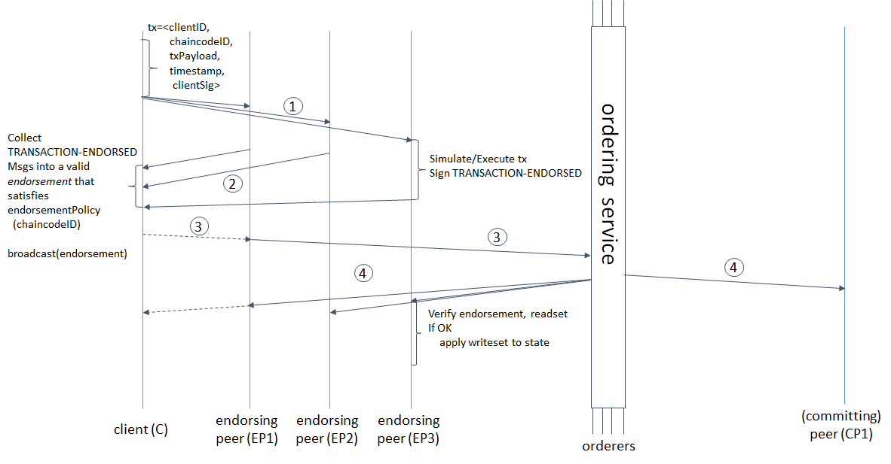
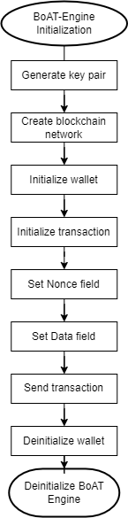

# BoAT Edge Overall Design

## Introduction

### Purpose
This document describes the overall system design of BoAT Edge (referred to as BoAT hereafter), including the architectural design, subsystem functionalities, internal and external interfaces, key processes, and key technical design descriptions. It aims to guide the overall design and testing strategy/specification of each subsystem. The intended readers of this document are BoAT Edge design personnel.

### Abbreviations
|Term   |Explanation                  |
|:----- |:--------------------------- |
|ABI    |Application Binary Interface |
|BE     |BoAT-Engine                  |
|BIA    |BoAT Infra Arch              |
|BoAT   |Blockchain of AI Things      |
|BPT    |BoAT-ProjectTemplate         |
|BSL    |BoAT-SupportLayer            |
|RLP    |Recursive Length Prefix      |
|RNG    |Random Numeral Generator     |
|RPC    |Remote Procedure Call        |
|TEE    |Trusted Execution Environment|
|RAM    |Random Access Memory         |

## BoAT Edge Design Objectives
As a blockchain application for the Internet of Things (IoT) edge, BoAT Edge should be designed with minimal changes required for easy and quick porting to various IoT devices or modules. The design of BoAT Edge follows the following principles:
+ Hierarchical design
+ Support for multiple blockchain protocols
+ Scalable design
+ Key security design
+ Provision of C language interface contract generation tools for different blockchains

## BoAT Edge Position in the Entire Blockchain Network
As a middleware connecting IoT devices and the blockchain, BoAT Edge's position in the entire interaction network is shown in Figure 3-1.
  
Figure 3-1: BoAT's position in the blockchain interaction network

## BoAT Edge Implementation Framework
The IoT blockchain application functionality provided by BoAT Edge is implemented through the BoAT Infra Arch (BIA) infrastructure architecture. The BIA infrastructure architecture is a design framework for IoT blockchain application development. It separates the blockchain application from the IoT platform through a layered design and integrates different application platforms under a unified application framework through bottom-layer abstractions, enabling support for multiple blockchains and cross-platform design within a defined scope.

  
Figure 4-1: BoAT Infra Arch overall architecture diagram

As shown in the diagram, the BIA architecture consists of four layers from top to bottom:

+ Application layer:  
The application layer, IoT Application, designs and implements IoT application functionalities based on the requirements of IoT device application scenarios. It achieves this by calling the APIs provided by the Composable BoAT Core layer and the BoAT Support Layer.

+ Composable BoAT Core layer:  
The Composable BoAT Core layer is the core component of BoAT. These components can be composed and deployed together. The diagram shows multiple BoAT components, including BoAT-Provisioner, BoAT-ATRelayer, and BoAT-Lite in dashed boxes, which are private components not yet open-sourced. The solid box represents the open-source component, BoAT-Engine.
  - BoAT Engine: Provides a multi-chain client API based on the BoAT-SupportLayer design for IoT applications. The application layer can implement IoT multi-blockchain application access through the API interface of BoAT Engine.
  - BoAT Provisioner: Provides an interface for managing initial key pairs for IoT devices, enabling personalized functionalities for IoT devices.
  - BoAT Lite: A signature service integrated with the BoAT Wake service.
  - BoAT AT Relayer: Extends the blockchain AT command and provides custom AT command definitions and general AT command forwarding for modules.

+ BoAT Support Layer:  
The BoAT Support Layer includes the operating system and driver abstraction layer, as well as the general components of BoAT. Through the abstraction provided by the BoAT-SupportLayer, it provides the application layer with a universal API interface based on different operating platforms. This allows the BoAT Infra Arch framework to achieve cross-platform application in the supported operating platforms. In other words, when an IoT device switches to a hardware platform supported by the BIA architecture, the application program only needs to select the appropriate platform, recompile it, and it can run in the new hardware environment.
  - OSAL: An abstraction layer that encapsulates operating system functionality, such as dynamic memory, tasks, semaphores, and queues.
  - DAL: An abstraction layer for hardware driver programs and module extensions, such as UART and virtual AT.
  - BoAT common components: The common libraries of BoAT, such as blockchain encryption libraries, RLP encoding, RPC services, key pair management, etc.

+ RTOS/Module OpenSDK Layer:  
The RTOS/Module OpenSDK Layer is the operating system layer of the IoT device, including the RTOS (Linux, FreeRTOS, Azure RTOS, etc.) used in the MCU or the SDK provided by the module vendor for OpenCPU applications. Apart from Module Vendor Extensions, the other parts are initially provided by the chip vendor.
  - HAL: Hardware abstraction layer.
  - Driver Framework: A framework for managing driver programs and providing a unified driver interface, such as read(), write(), ioctl().
  - Operating System: RTOS or Linux.
  - System Common Libs.: System-provided common libraries, such as C library, TLS library, MQTT/HTTP/TCP/IP library.
  - Module Vendor Extensions: Module vendor extensions, specific to the module vendor's additional functionalities on top of the chip, such as module-specific AT commands. These are not included in the MCU application.

BoAT-Engine and BoAT-SupportLayer are two open-source components of the BoAT Infra Arch framework.

The implementation components of the framework are shown in Figure 4-2:

  
Figure 4-2: BoAT Infra Arch implementation components diagram

BoAT-Engine provides multiple blockchain access interfaces based on the BoAT-SupportLayer. It consists of the Wallet, Protocol, Network, and Tools components.

- Wallet: Provides a wallet for IoT blockchain applications and corresponding transaction interfaces.
- Protocol: Implements various blockchain protocol interfaces.
- Network: Provides interfaces related to blockchain network information.
- Tools: Used for generating C language interfaces for smart contracts.

BoAT-SupportLayer provides OS API abstractions, driver abstractions, and general component interfaces. It enables cross-platform design features within the supported platforms of the BoAT Infra Arch.

- BoAT Common Components: Provides RPC services to the protocol layer, cryptographic algorithms, signing, and intermediate storage interfaces to the wallet interface, and services such as data format conversion and message encoding/decoding to all layers.
- OSAL: Abstracts system APIs of different platforms into unified generic interfaces, providing cross-platform design services for upper-layer applications. The implementation of the common components depends on the OSAL and DAL support of the corresponding platform.
- DAL: Abstracts drivers and specific functionalities of different platforms into unified generic interfaces, providing cross-platform design services for upper-layer applications.

### BoAT-Engine
#### Overview

BoAT-Engine is located at the top layer of the blockchain application interface, providing access to various blockchains for IoT applications. BoAT-Engine includes the following interface components:
+ Wallet Interface:
  * The wallet interface is the entry point of the BoAT SDK, and different blockchains have similar wallet entry points.
  * Different blockchains implement their own wallet entry points and corresponding wallet transactions. Each blockchain provides a set of transaction interfaces with similar functionality but different implementations.
+ Protocol Interface:
  * Application interfaces for different blockchain protocols, with different protocols for different blockchains.
+ Network Interface:
  * Provides interfaces related to blockchain network information, including blockchain node types, connection methods, role types, and other blockchain network-related information.
+ Tools Interface:
  * Used for generating C language interfaces for smart contracts.

The interfaces of BoAT-Engine are supported by the BoAT-SupportLayer. For a description of the BoAT-SupportLayer, please refer to [BoAT-SupportLayer](#BoAT-SupportLayer).

The detailed composition of BoAT-Engine is shown in Figure 4-3:

Figure 4-3: Internal composition of BoAT-Engine

#### Wallet Blockchain Wallet Interface
The blockchain wallet consists of two parts: the wallet interface and the transaction interface, which respectively implement blockchain wallet management and blockchain transaction management.

##### Wallet Interface
###### Data structures and function implementations of the wallet interface
The wallet is a container that stores not only the necessary information for accessing the blockchain but also a key pair structure and the **blockchain network information structure**.

In the data structure of the wallet, the following elements should be included at least:
  + Account private key
  + Blockchain network information

In addition to the required elements, the data structure of the wallet can optionally include:
  + Account address

The wallet should implement the following functions:
  + BoAT-Engine initialization
  + BoAT-Engine deinitialization
  + Wallet creation
  + Wallet deletion

 ###### Wallet Interface Function Implementation Summary
####### BoAT-Engine Initialization/Deinitialization
+ BoAT-Engine Initialization:
Before using the BoAT SDK, BoAT-Engine initialization should be performed. The interface includes the following:
  1. Global resource initialization:
If some third-party libraries used by the SDK require initialization before calling, the initialization should be performed here, such as the cjson and curl libraries used by the *protocol* layer.
+ SDK Deinitialization:
After using the BoAT SDK, SDK deinitialization should be performed to release resources. The interface includes the following:
  1. Global resource deinitialization:
If some third-party libraries used by the SDK require deinitialization before calling, the deinitialization should be performed here, such as the cjson and curl libraries used by the *protocol* layer.

####### Wallet Operations
+ Wallet Initialization:
This interface is used to create a new wallet or read an existing wallet. The interface includes the following:
  1. Create a new wallet or read an existing wallet based on the input parameters.
  2. Perform wallet initialization for a specific blockchain based on the input parameters, such as performing Ethereum wallet initialization or PlatONE wallet initialization.

+ Wallet Deinitialization:
Release the system resources used during wallet initialization.

##### Transaction Interface
###### Data Structures and Function Implementations of Wallet Transactions
A transaction is a signed message that is propagated through the blockchain network and recorded on the blockchain. The transaction interfaces provided by different blockchains have similar functionalities.

For Ethereum/Polygon/PlatON/PlatONE/FISCO BCOS/Venachain:

A transaction should include at least the following elements:
+ Wallet data structure
+ Transaction identifier
+ Transaction message required

The transaction interface should provide the following functionalities:
+ Wallet initialization
+ Wallet deinitialization
+ Account balance query
+ Transaction initialization
+ Send transaction
+ Query transaction receipt
+ Stateless message call

###### Summary of Ethereum/Polygon Transaction Interface Function Implementation
+ Wallet Initialization:
  The interface includes the following:
  1. Set the blockchain contract address.
  2. Set whether the transaction specifies the chain ID.
  3. Set the chain ID.

+ Wallet Deinitialization:
  The interface includes the following:
  1. Clear private key information.
  2. Release blockchain network information resources.
  3. Call the web3 interface provided by the protocol layer: web3 interface deinitialization.

+ Account Balance Query:
  The interface includes the following:
  1. Prepare the message information required for account balance query.
  2. Call the web3 interface provided by the protocol layer: get account balance.

+ Transaction Initialization:
  This interface mainly initializes the fields in the transaction structure. In the Ethereum transaction structure, in addition to the v, r, and s fields of the signature, there are six fields: nonce, gasPrice, gasLimit, recipient, value, and data. Please note that the setting of the nonce field of the transaction is not implemented in this interface, but is set at the time of transaction sending, because the user may create multiple transaction messages simultaneously, and the order in which these messages are sent to the blockchain network is not guaranteed. It should also be noted that the nonce and gasPrice fields should be obtained from the blockchain by calling the corresponding web3 interface provided by the protocol layer. This method requires network access and will generate some network traffic.
  The interface includes the following:
  1. Set the GasPrice field of the transaction.
  2. Set the GasLimit field of the transaction.
  3. Set the Recipient field of the transaction.
  4. Set the Value field of the transaction.

+ Send Transaction:
  The interface includes the following:
  1. Check the synchronous/asynchronous flag (if any).
  2. If flagged as synchronous, call the raw transaction interface provided by the protocol layer: send raw transaction synchronously.
  3. If flagged as asynchronous, call the raw transaction interface provided by the protocol layer: send raw transaction asynchronously.

+ Query Transaction Receipt:
  The interface includes the following:
  1. Prepare the message information required for querying the transaction receipt.
  2. Call the web3 interface provided by the protocol layer "get transaction receipt" every specified time until the timeout is triggered.
  3. Return the query result.

+ Send Ether:
  The interface includes the following:
  1. Set the nonce field of the transaction.
  2. Set the value field of the transaction.
  3. Set the data field of the transaction.
  4. Execute the transaction sending.

+ Stateless Message Call:
  The interface includes the following:
  1. Prepare the message information required for stateless message call.
  2. Call the web3 interface provided by the protocol layer "blockchain stateless call".

###### Summary of PlatON Transaction Interface Function Implementation

Compared to Ethereum, PlatON has the following differences:

1. Different address formats:
   PlatON has added an additional address format similar to Bitcoin's Bech32 format on top of Ethereum. Therefore, when initializing a transaction, in addition to the required Ethereum parameters, it is also necessary to set the HRP (Human-readable parts) of the address. The wallet will automatically use the specified address format when making RPC calls.

2. Different function names for RPC calls:
   There is no difference for BoAT SDK users.

3. Specific blockchain ID requirement for PlatON:
   EIP-155 describes two data formats that can be used for transactions, but PlatON only supports one. Please refer to the
   [raw transaction interface description](#Raw-Transaction-Interface) for more details.

When designing the data structure and code implementation for PlatON, it is important to consider inheritance and code reuse. This helps to reduce code complexity and facilitate maintenance. Although PlatON's transaction structure is similar to Ethereum's, there is a need for Bech32 format addresses in some RPC commands. Therefore, in the data structure design, two additional fields for storing Bech32 format addresses are added. One possible design approach is shown in Figure 4-4:

  
Figure 4-4: Possible design approach for PlatON data structure

Figure 4-4 illustrates a possible design approach for PlatON's data structure. It is important to note that the two additional address fields for PlatON should be placed at the end of the data structure without compromising the integrity of the reusable Ethereum data structure. If the integrity of the Ethereum data structure is compromised, it will render the related implementation methods in Ethereum unusable.

###### Summary of PlatONE Transaction Interface Function Implementation

The differences between PlatONE and Ethereum are as follows:

+ Transaction Initialization:
  In addition to the initialization steps described for Ethereum, PlatONE also requires:
  1. Setting the transaction type field.

As mentioned earlier, the differences between PlatONE and Ethereum are minimal. When designing the data structure and code implementation for PlatONE, it is important to consider inheritance and code reuse. This helps to reduce code complexity and facilitate maintenance. For example, in terms of the composition of the transaction structure, PlatONE's transaction structure has an additional transaction type field compared to Ethereum. Therefore, in the data structure design, one possible approach is shown in Figure 4-5:

  
Figure 4-5: Possible design approach for PlatONE data structure

Figure 4-5 illustrates a possible design approach for PlatONE's data structure. It is important to note that the transaction type field for PlatONE should be placed at the end of the data structure without compromising the integrity of the reusable Ethereum data structure. If the integrity of the Ethereum data structure is compromised, it will render the related implementation methods in Ethereum unusable.

###### Summary of FISCO BCOS Transaction Interface Function Implementation

Compared to Ethereum, FISCO BCOS has the following differences. Please refer to the official FISCO BCOS documentation at https://fisco-bcos-documentation.readthedocs.io/zh_CN/latest/docs/design/protocol_description.html for more details.

When designing the data structure and code implementation for FISCO BCOS, it is important to consider inheritance and code reuse. This helps to reduce code complexity and facilitate maintenance. In the transaction structure, four additional fields have been added:

1. `blockLimit`: Transaction lifecycle.
2. `chainId`: Chain information.
3. `groupId`: Group ID.
4. `extraData`: Reserved field.

Therefore, in the data structure design, one possible approach is shown in Figure 4-6:

  
Figure 4-6: Possible design approach for FISCO BCOS data structure

Figure 4-6 illustrates a possible design approach for FISCO BCOS's data structure. It is important to note that the transaction type field for FISCO BCOS should be placed at the end of the data structure without compromising the integrity of the reusable Ethereum data structure. If the integrity of the Ethereum data structure is compromised, it will render the related implementation methods in Ethereum unusable.

***Note: Since FISCO BCOS has added new fields in transactions, the RLP encoding process is different from Ethereum.***

###### Summary of Fabric Transaction Interface Function Implementation

- Wallet Initialization:
  This interface includes the following steps:
  1. Allocate space for the wallet structure.
  2. Set the private key path/index for the account.
  3. Set the certificate for the account.
  4. If TLS is required, set the root certificate for server identity verification.
  5. If TLS requires mutual authentication, set the client's private key path/index and corresponding certificate.
  6. Set the node information such as the number of endorsement and ordering nodes, addresses, and hostnames. If TLS is enabled, the hostname field will be used for server identity verification and should match the CN field in the server TLS certificate. If TLS is not enabled, the hostname will be ignored.
  7. Initialize the HTTP2 environment.

- Wallet Deinitialization:
  This interface includes the following steps:
  1. Free the space allocated for the account's private key path/index and certificate.
  2. Free the space allocated for the client's TLS private key path/index and certificate (if TLS is enabled).
  3. Free the space allocated for the root certificate (if TLS is enabled).
  4. Free the space allocated for endorsement/ordering node information.
  5. Deinitialize the HTTP2 environment.
  6. Free the space allocated for the wallet structure.

- Transaction Initialization:
  This interface includes the following steps:
  1. Set the attributes of the chaincode to be accessed: path, name, version.
  2. Set the channel name of the client initiating the transaction.
  3. Set the organization name of the client initiating the transaction.

- Transaction Deinitialization:
  This interface includes the following steps:
  1. Free the space allocated for the chaincode attributes.
  2. Free the space allocated for the channel name.
  3. Free the space allocated for the organization name.

- Transaction Parameter Setting:
  This interface includes the following steps:
  1. Set the timestamp of the transaction initiation.
  2. Set the parameters of the transaction.

- Send Transaction:
  This interface includes the following steps:
  1. Send the message for query-related transactions.
  2. Send the message for invoke-related transactions.

#### Network Blockchain Network Interface
#### Overview
The blockchain network interface is a set of information related to the blockchain network. This information is used to build a blockchain wallet and serves as parameters for connecting to the blockchain network in subsequent blockchain applications. This network information is stored in IoT devices. Since the BoAT SDK runs on the application processor of the cellular module, the resources in its runtime environment are limited. For example, some cellular modules may not provide access interfaces to non-volatile memory. On the other hand, from the user's perspective, some users may only want to create a temporary network for testing and do not want to store it permanently. Therefore, in the design of the BoAT SDK, network information storage is divided into two categories: persistent and disposable. Persistent network information (Network) is stored in the non-volatile memory of the runtime environment and will not be lost in case of power failure. Disposable network information (Network) is stored in the RAM of the runtime environment and will be lost in case of power failure.
#### Implementation of Network Blockchain Network Interface
##### Data Structure and Function Implementation Checklist for Network
The Network data structure stores the necessary information for accessing the blockchain. The Network data structure for different blockchains is defined based on their network characteristics and can include the network information of one or more network nodes.

The Network data structure should include at least the following elements:
  + Index for storing blockchain network information
  + URL and port of the blockchain network
  + Information about the characteristics of the blockchain network

The Network should implement the following functions:
  + Network creation
  + Network deletion
  + Network unloading
  + Querying Network information based on index

##### Brief Description of Network Interface Function Implementation
###### Network Operations
+ Network Creation:  
This interface is used to create a new Network or retrieve an existing Network. The interface includes the following steps:
  1. Check if the Network list is full.
  2. Decide whether to create a disposable Network or a persistent Network based on the specific input parameters.
  3. Implement Network storage operations specific to different blockchains and store the Network information in the corresponding location/file.
+ Network Deletion:  
This interface deletes a Network information based on the given Network storage index. Deletion operations are divided into two categories:
  1. When the index is 0, delete the Network information from memory directly.
  2. When the index is greater than 0 and less than the storage limit, delete the specified Network file from non-volatile memory.
+ Querying Network Information based on Index:  
This interface is used to query Network information based on the given input parameter (which can be the storage index, Network address, etc.). The interface includes the following steps:
  1. Return the corresponding Network information based on the specific input parameter.

### Protocol Blockchain Protocol Interface
#### Overview
The protocol interface is responsible for implementing the protocol part of each blockchain. For Ethereum-based blockchains, such as Polygon, PlatON, PlatONE, and FISCO BCOS, their protocols are quite similar.   

#### Implementation of Ethereum Protocol Layer
##### Raw Transaction Interface
The raw transaction interface in the protocol layer provides services to the transaction interface "send transaction" in the interface layer. The raw transaction interface should provide at least the following interfaces to the upper layer:
+ Asynchronous sending of raw transaction

In addition, the raw transaction interface can optionally provide the following interface:
+ Synchronous sending of raw transaction

##### Brief Description of Raw Transaction Interface
+ Asynchronous Sending of Raw Transaction
This interface implements the data encoding of raw transactions, such as RLP encoding of various fields, hash calculation, signature, etc. It internally calls the web3 interface to send the transaction to the blockchain without waiting for the transaction to be successfully executed. The data encoding can be done with or without specifying the chain ID. Refer to EIP-155 <https://eips.ethereum.org/EIPS/eip-155> for specific details.
This interface includes the following steps:
  - If the data encoding is done without specifying the chain ID:
  1. Perform RLP encoding on the six fields of the transaction: nonce, gasPrice, gasLimit, recipient, value, and data.
  2. Calculate the keccak-256 hash of the previous step.
  3. Sign the hash from the previous step to obtain the parity, r, and s values.
  4. Perform RLP encoding on the nine fields of the transaction: nonce, gasPrice, gasLimit, recipient, value, data, v, r, and s, where v = parity + 27. The values of parity, r, and s are obtained from the previous step.
  5. Call the web3 interface "send raw transaction" to send the transaction to the blockchain.
  - If the data encoding is done with specifying the chain ID:
  1. Perform RLP encoding on the nine fields of the transaction: nonce, gasPrice, gasLimit, recipient, value, data, v, r, and s, where v = chainID, r = 0, s = 0.
  2. Follow the steps 2-5 of the "without specifying the chain ID" approach.

***Note: EIP-155 must be enabled for Polygon.***

+ Synchronous Sending of Raw Transaction  
The synchronous sending of raw transaction interface executes the "asynchronous sending of raw transaction" and waits for the transaction to be successful or times out before returning. The steps involved in this interface are as follows:
  1. Execute the asynchronous sending of raw transaction.
  2. Execute the query for transaction receipt.
  3. Wait for the transaction to be successful or time out before returning.

##### Web3 Interfaces
In addition to the raw transaction interface, the protocol layer should provide the following web3 interfaces to the upper layer:
+ Web3 interface initialization.
+ Web3 interface deinitialization.
+ Get blockchain storage at a specific location.
+ Get the transaction count of an account.
+ Get the gas price of the blockchain.
+ Get the account balance.
+ Get the transaction receipt.
+ Stateless call to the blockchain.
+ Send raw transaction.

By referring to the RPC documentation of Ethereum, it can be found that Ethereum provides approximately 64 RPC methods. In the BoAT SDK, we only implement the above-mentioned methods. The reason is the same as described in the [Wallet Interface](#Wallet-Interface) section. The resources in the SDK runtime environment are limited. The above-mentioned RPC methods are commonly used for data on-chain. If customers require the implementation of other RPC methods in the future, the BoAT SDK will provide them in a customized manner.

##### Brief Description of Web3 Interfaces
+ Web3 Interface Initialization  
  The steps involved in this interface are as follows:
  1. Resource allocation for the web3 interface, such as memory allocation for RPC content, memory allocation for JSON strings requested from or responded by the blockchain, and memory allocation for parsing the response JSON string.
  2. Initialization of the web3 message ID.
  3. Execution of the "RPC Interface Initialization" in the RPC layer.

+ Web3 Interface Deinitialization  
  The steps involved in this interface are as follows:
  1. Release of resources used by the web3 interface, such as memory deallocation for RPC content, memory deallocation for JSON strings requested from or responded by the blockchain, and memory deallocation for parsing the response JSON string.
  2. Execution of the "RPC Interface Deinitialization" in the RPC layer.

+ Get Blockchain Storage at a Specific Location  
  The steps involved in this interface are as follows:
  1. Increment the web3 message ID.
  2. Organize the JSON string message for the "Get Blockchain Storage at a Specific Location" request to be sent to the blockchain.
  3. Call the RPC method "web3_getStorageAt" to send the request message to the blockchain.
  4. Parse the received blockchain response message and return the parsing result.

+ Get Account Transaction Count  
  The steps involved in this interface are as follows:
  1. Increment the web3 message ID.
  2. Organize the JSON string message for the "Get Account Transaction Count" request to be sent to the blockchain.
  3. Call the RPC method "web3_getTransactionCount" to send the request message to the blockchain.
  4. Parse the received blockchain response message and return the parsing result.

+ Get Blockchain Gas Price  
  The steps involved in this interface are as follows:
  1. Increment the web3 message ID.
  2. Organize the JSON string message for the "Get Blockchain Gas Price" request to be sent to the blockchain.
  3. Call the RPC method "web3_gasPrice" to send the request message to the blockchain.
  4. Parse the received blockchain response message and return the parsing result.

+ Get Account Balance  
  The steps involved in this interface are as follows:
  1. Increment the web3 message ID.
  2. Organize the JSON string message for the "Get Account Balance" request to be sent to the blockchain.
  3. Call the RPC method "web3_getBalance" to send the request message to the blockchain.
  4. Parse the received blockchain response message and return the parsing result.

+ Get Transaction Receipt  
  The steps involved in this interface are as follows:
  1. Increment the web3 message ID.
  2. Organize the JSON string message for the "Get Transaction Receipt" request to be sent to the blockchain.
  3. Call the RPC method "web3_getTransactionReceiptStatus" to send the request message to the blockchain.
  4. Parse the received blockchain response message and return the parsing result.

+ Stateless Call to the Blockchain  
  The steps involved in this interface are as follows:
  1. Increment the web3 message ID.
  2. Organize the JSON string message for the "Stateless Call to the Blockchain" request to be sent to the blockchain.
  3. Call the RPC method "web3_call" to send the request message to the blockchain.
  4. Parse the received blockchain response message and return the parsing result.

+ Send Raw Transaction  
  The steps involved in this interface are as follows:
  1. Increment the web3 message ID.
  2. Organize the JSON string message for the "Send Raw Transaction" request to be sent to the blockchain.
  3. Call the RPC method "web3_sendRawTransaction" to send the request message to the blockchain.
  4. Parse the received blockchain response message and return the parsing result.

#### Protocol Layer Implementation of PlatON
The protocol layer implementation of PlatON is exactly the same as Ethereum's protocol layer, with the only difference being that PlatON only supports the specified chain ID for data encoding.

#### Protocol Layer Implementation of PlatONE
The protocol layer implementation of PlatONE is almost the same as Ethereum's protocol layer, with the only difference being that there are additional encodings for the transaction type in the data field filling and RLP encoding process of raw transactions. Since the data field filling and RLP encoding of raw transactions are implemented by the users using the BoAT SDK before calling the relevant BoAT SDK APIs, the protocol layer of PlatONE can reuse the protocol layer of Ethereum.

#### Protocol Layer Implementation of FISCO BCOS
The protocol layer implementation of FISCO BCOS is almost the same as Ethereum's protocol layer, with the only difference being that there are additional encodings for four fields in the RLP encoding process of raw transactions. Since the RLP encoding of raw transactions is implemented by the users using the BoAT SDK before calling the relevant BoAT SDK APIs, the protocol layer of FISCO BCOS can reuse the protocol layer of Ethereum.

#### Protocol Layer Implementation of Fabric
##### Overview of Fabric Protocol
The Fabric protocol layer mainly includes the endorsement protocol and the transaction protocol, with the query protocol being the same as the endorsement protocol. The endorsement protocol and the transaction protocol are shown in Figure 4-7 and Figure 4-8 respectively.
  
Figure 4-7 Fabric Proposal Message Structure
  
Figure 4-8 Fabric Transaction Message Structure

When a Fabric client initiates a transaction, it first sends a proposal to the endorsing peers. The endorsing peers sign the proposal and return the signature data. The Fabric client then organizes the signature data, transaction parameters, and endorsing peer signatures into a transaction message and sends it to the ordering service node. After the ordering service node verifies the transaction, it updates the state of the ledger. The detailed transaction process is shown in Figure 4-9, which is extracted from the "hyperlEdger-fabricdocs master" document. For more information about Fabric, please refer to the Fabric documentation <https://hyperledger-fabric.readthedocs.io/en/release-1.4/>.

  
Figure 4-9 Fabric Transaction Flow

##### Fabric Protocol Interface Implementation
In the Fabric message, the fields in the protocol are serialized using protobuf and then sent using the HTTP2 protocol. As mentioned in the previous chapters, there are some repeated and similar parts in the proposal message and the transaction message. These repeated parts can be split into sub-modules for easier reuse. One possible way to split them is as follows:
- Packing the channel header
- Packing the signature header
- Packing the proposal payload
- Packing the transaction payload

### Implementation of Common Tools
#### Overview
Common tools exist independently of the individual layers and are used to generate C language interfaces for accessing blockchain smart contracts. Common tools are typically implemented using scripting languages. The common tools include:
- Tools for generating C language interfaces for Ethereum smart contracts
- Tools for generating C language interfaces for PlatONE smart contracts
- Tools for generating C language interfaces for FISCO BCOS smart contracts
- Tools for generating C language interfaces for Venachain smart contracts

#### Brief Description of Common Tools
##### Tools for Generating C Language Interfaces for Ethereum Smart Contracts
The most commonly used programming language for Ethereum smart contracts is Solidity. After compilation, Solidity generates a JSON file that describes the contract interface. The contract interface in JSON format is given by an array of functions and/or events. The description of a function is a JSON object with the following fields:
- type: "function", "constructor", "receive" (function that receives Ether), or "fallback" (default function)
- name: name of the function
- inputs: an array of objects, each object containing:
  - name: parameter name
  - type: canonical type of the parameter
  - components: used for tuple types
- outputs: an array of objects similar to inputs, can be omitted if the function has no return value
- payable: true if the function accepts Ether, false by default
- stateMutability: one of the following values: pure (specified as not reading blockchain state), view (specified as not modifying blockchain state), nonpayable, and payable (same as above)
- constant: true if the function is specified as pure or view

For the generated C language contract interface, the corresponding relationship with the JSON object is as follows:
<table>
    <tr>
        <td colspan="2">JSON Object</td>
        <td>JSON Object Value</td>
        <td>C Language Contract Interface</td>
    </tr>
    <tr>
        <td colspan="2">Type</td>
        <td>/</td>
        <td>/</td>
    </tr>
    <tr>
        <td colspan="2">Name</td>
        <td>/</td>
        <td>Function Name </td>
    </tr>
    <tr>
        <td rowspan="3">Inputs</td>
        <td>Name</td>
        <td>/</td>
        <td>Function Parameter Name</td>
    </tr>
     <tr>
        <td>Type</td>
        <td>/</td>
        <td>Function Parameter Type</td>
    </tr>
     <tr>
        <td>components</td>
        <td>/</td>
        <td>/</td>
    </tr>
      <tr>
        <td colspan="2">Outputs</td>
        <td>/</td>
        <td>Since the contract returns an HTTP message, the function should be treated as char*</td>
    </tr>
     <tr>
        <td colspan="2">Payable</td>
        <td>/</td>
        <td>/</td>
    </tr>
     <tr>
        <td colspan="2">stateMutability</td>
        <td>/</td>
        <td>/</td>
    </tr>
    <tr>
        <td colspan="2" rowspan="2">Constant</td>
        <td>True</td>
        <td>The function accesses the blockchain through the RPC method "web3_call"</td>
    </tr>
    <tr>
        <td>False</td>
        <td>The function accesses the blockchain through the RPC method "web3_sendRawTransaction"</td>
    </tr>
</table>

##### Tool for Generating PlatONE Smart Contract C Language Interface
The commonly used programming language for PlatONE smart contracts is C++. Similar to Ethereum, a JSON file describing the contract interface is generated after compiling the PlatONE smart contract. The JSON fields of PlatONE are the same as Ethereum, and the correspondence between the C language interface and JSON fields is also consistent with Ethereum.

##### Tool for Generating FISCO BCOS Smart Contract C Language Interface
The commonly used programming language for FISCO BCOS smart contracts is Solidity. For more details, please refer to the [Tools for Generating C Language Interfaces for Ethereum Smart Contracts](#Tools-for-Generating-C-Language-Interfaces-for-Ethereum-Smart-Contracts).

##### Tool for Generating Venachain Smart Contract C Language Interface
The commonly used programming language for Venachain smart contracts is C++. Similar to Ethereum, a JSON file describing the contract interface is generated after compiling the Venachain smart contract. The JSON fields of Venachain are the same as Ethereum, and the correspondence between the C language interface and JSON fields is also consistent with Ethereum.

### BoAT-SupportLayer

The detailed composition of BoAT-SupportLayer is shown in Figure 4-10:
  
Figure 4-10: Internal Components of BoAT-SupportLayer

#### BoAT Common Components
##### Keypair
In the design of the keypair, the private key and public key are stored as a whole. There are two types of storage: persistent keypair and one-time keypair. Persistent keypairs are stored in non-volatile storage in the runtime environment and will not be lost in case of power failure. One-time keypairs are stored in the RAM of the runtime environment and will be lost in case of power failure.

  + Keypair Configuration
  + Keypair Generation
  + Keypair Verification
  + Query Keypair Information by Index

###### Keypair Operations
+ Keypair Configuration:
This interface is used to set the keypair for the wallet. It includes the following steps:
  1. Perform keypair verification.
  2. Assign the keypair.
  3. Generate the public key from the keypair (optional).
  4. Generate the address from the public key (optional).

+ Keypair Generation:
This interface is used to generate a valid keypair. It includes the following steps:
  1. Generate a keypair using random numbers.
  2. Perform keypair verification.
  3. If the verification fails, go back to step 1 and generate a new keypair. If the verification succeeds, return the generated keypair.

+ Keypair Verification:
This interface is used to check if a given keypair is valid. It includes the following steps:
  1. Check if the keypair is within the valid range of keypairs.

+ Query Keypair Information by Index:
This interface is used to query a keypair based on the index. It includes the following steps:
  1. Return the corresponding keypair information based on the specific input parameter (the input parameter can be the storage index value).

#### Keystore
+ SE (Secure Element)
+ Soft (Software)

##### Signature
The signature is implemented purely in software by the BoAT SDK. It uses the ECDSA (Elliptic Curve Digital Signature Algorithm) for signing, similar to Ethereum.

#### Third-party
+ RLP Encoding
+ JSON Encoding/Decoding
+ Encryption Algorithms
+ Hash Algorithms (e.g., Keccak-256 used in Ethereum)

##### RLP Encoding
##### Structure of RLP
RLP encoding is used in two places: organizing transaction messages at the protocol layer and generating C language contract interface code. RLP encoding only deals with two types of data: strings and lists. A string refers to a binary data, such as a byte array, while a list is a nested recursive structure that can contain strings and other lists. The structure of an RLP list is shown in Figure 4-11:
  
Figure 4-11: Structure of RLP List

##### RLP Encoding Rules
The encoding rules for RLP are described as follows:
+ If the length of a string is between 0 and 55 bytes, its RLP encoding is a single-byte prefix followed by the string itself. The value of the single-byte prefix is '0x80' plus the length of the string.
+ If the length of a string is greater than 55 bytes, its RLP encoding is a single-byte prefix followed by the encoding of the "string length" and the string itself. The value of the single-byte prefix is '0xB7' plus the byte length of the "string length".
+ If the length of a list is between 0 and 55 bytes, its RLP encoding is a single-byte prefix followed by the RLP encoding of each element in the list. The value of the single-byte prefix is '0xC0' plus the total length of the list.
+ If the length of a list is greater than 55 bytes, its RLP encoding is a single-byte prefix followed by the encoding of the "list length" and the RLP encoding of each element in the list. The value of the single-byte prefix is '0xF7' plus the byte length of the "list length".

For a more detailed description of the RLP encoding rules, please refer to the RLP wiki: https://eth.wiki/en/fundamentals/rlp

##### RLP Encoding Implementation
There can be multiple ways to implement RLP encoding. As mentioned earlier, one possible data structure composition for RLP encoding is shown in Figure 4-12:  
  
Figure 4-12: One Possible Data Structure for RLP Encoding

The diagram defines four types to represent the nested recursive structure of an RLP list. For example, if there is a list object named "List" that contains three string objects named "StringA," "StringB," and "StringC," the possible steps to encode the list object "List" using RLP are as follows:
1. Initialize the list object "List."
2. Initialize the string object "StringA."
3. Add "StringA" to the list object "List."
4. Initialize the string object "StringB."
5. Add "StringB" to the list object "List."
6. Initialize the string object "StringC."
7. Add "StringC" to the list object "List."
8. Encode the list object "List" using RLP.

In summary, the implementation of RLP should include at least the following:
+ RLP list initialization
+ RLP string initialization
+ Adding a string or list to a list
+ RLP encoding of a string
+ RLP encoding of a list
+ Replacing a string in a list
+ Removing a string from a list
+ Calculating the length of RLP encoding.

##### JSON Encoding/Decoding
In the BoAT SDK, JSON encoding and decoding are used in the message exchange between the SDK and the blockchain. When receiving response messages from the blockchain, JSON decoding is required. JSON encoding and decoding can be implemented using a third-party library called cJSON.

cJSON is a lightweight JSON encoder/decoder written in C language. It follows the ANSI-C standard and can be easily ported to different platforms and compilers. To use cJSON in the SDK, simply copy the cJSON.h and cJSON.c files into the SDK and include the header file "cJSON.h" wherever cJSON is needed. For more information about cJSON, please refer to the documentation on GitHub: cJSON<https://github.com/DaveGamble/cJSON#welcome-to-cjson>.

#### Common
##### Overview
In the implementation of various layers in the BoAT SDK, there is often a need for data format conversion, message encoding and decoding, etc. These functionalities can be abstracted into independent modules to provide services to different layers. These functional blocks include:
+ UTILITIES
+ RPC
+ Storage + Secure Storage (e.g., encrypted storage of private keys)

##### UTILITIES
The UTILITIES module provides data format conversion tools. In the design of the BoAT SDK, data format conversion is used in many places, such as converting input ASCII codes to binary format, converting binary format data returned from the blockchain to ASCII format for display, and handling endianness conversion in contract ABI interfaces. To facilitate usage, it is recommended to implement the functions for possible data conversions in the same file. Some possible data conversions include:
+ Converting binary data to hexadecimal string
+ Converting hexadecimal string to binary data
+ Converting uint32 data to big-endian format
+ Converting uint64 data to big-endian format
+ Performing byte order conversion on a byte stream

##### RPC
###### Overview
The RPC layer encapsulates the specific communication link for sending data to the blockchain node and provides services to the protocol layer. The RPC layer is an abstraction layer that implements the sending link, making it easier to port the BoAT SDK to different runtime environments.

###### Extensible Design of the RPC Layer
The RPC layer can be extended to support different sending link implementations based on the specific runtime environment. For example, some environments provide the cURL tool for sending and receiving messages, while others may not support cURL but provide AT commands for sending and receiving messages. The RPC layer encapsulates these different implementations and provides a unified interface to the upper layer, allowing the protocol layer to not be concerned with the specific sending link. The protocol layer can simply call the unified interface when sending or receiving messages. The encapsulation of different sending links by the RPC layer also facilitates the extension to support more link implementations.

###### Extension of cURL in the RPC Layer
cURL is a command-line tool for transferring files using URL syntax. It supports various communication protocols such as FTP, FTPS, HTTP, HTTPS, etc. When enabling cURL support in the RPC layer, in addition to performing global resource initialization for cURL during SDK initialization, the following steps need to be implemented in the RPC layer:
1. cURL session initialization
2. Setting the URL format as \<protocol\>://<target name | IP>:\<port\>
3. Configuring the supported protocols for cURL
4. Configuring SSL certificates (if required)
5. Setting the HTTP type as POST
6. Setting timeout values (response timeout, connection timeout)
7. Setting HTTP headers
8. Setting the callback function and receive buffer for HTTP response
9. Setting the POST content
10. Executing the RPC request
11. Cleaning up and releasing cURL resources

### OSAL and DAL

#### Overview
The BoAT SDK runs on different hardware platforms, and various vendors provide different hardware platform functionalities. For example, some hardware platforms provide hardware implementations of random number generators, while others not only provide hardware implementations of random number generators but also provide TEE environments. In order to better utilize the resources of the platform and isolate software changes, the BoAT SDK has designed the OSAL and DAL layers, which implement common abstract API interfaces based on the hardware platform (platform) to provide low-level services such as random number generators, secure storage, and cryptographic signatures to the application layer and BoAT-Engine. When the hardware platform can provide the corresponding implementation, the OSAL and DAL layers will call the corresponding hardware functions through the vendor's reserved interface. When the hardware platform does not provide the corresponding services, the functionality is implemented in pure software.

OSAL provides an abstraction of the hardware platform operating system API.
DAL provides an abstraction of the hardware platform device driver API.

#### Pure Software Implementation of OSAL and DAL Layers
The OSAL and DAL layers should provide pure software implementations of various required services. This allows the BoAT SDK to run completely even when the hardware cannot provide the corresponding services. The OSAL and DAL layers should cover the necessary hardware services and provide at least the following functionalities in pure software:

##### OSAL Abstract Implementation
+ mutex: binary semaphore
+ queue: message queue
+ timer: timer
+ sem: semaphore
+ task: task or thread
+ malloc: heap memory allocation
+ free: heap memory release
+ time: timestamp
+ random: random number generator

##### DAL Abstract Implementation
+ i2c: driver interface
+ uart: serial port interface
+ virtualAT: virtual AT interface
+ storage: file storage interface
+ ssl: secure socket interface

#### TEE Support
BoAT's design should consider support for TEE environments. For hardware with TEE environments, BoAT should be able to place sensitive information in the TEE environment with minimal modifications. To meet this goal, the design of the wallet should meet the following criteria:
+ Modular design of wallet-related data structures
+ Modular design of wallet-related implementations
+ Sensitive information related to the wallet should not be reflected outside the wallet.

## The Process of Creating a Blockchain Transaction using BoAT SDK
### Creating an Ethereum Transaction using BoAT SDK
The typical process of creating an Ethereum transaction using BoAT SDK is illustrated in Figure 5-1:  
  
Figure 5-1 Process of Creating a Transaction using BoAT

The steps involved in this process are as follows:
+ BoAT-Engine SDK Initialization:
Please refer to the section [BoAT-Engine SDK Initialization/Deinitialization](#BoAT-Engine-SDK-InitializationDeinitialization) for details on initializing the BoAT-Engine SDK.
+ Wallet Creation:
Please refer to the section [Wallet Operations](#Wallet-Operations) for details on creating a wallet.
+ Transaction Initialization:
Please refer to the section [Implementation Overview of Ethereum/Polygon Transaction Interface Functions](#Implementation-Overview-of-EthereumPolygon-Transaction-Interface-Functions) for details on transaction initialization.
+ Setting the Nonce Field
+ Setting the Data Field
+ Sending the Transaction:
Please refer to the section [Implementation Overview of Ethereum/Polygon Transaction Interface Functions](#Implementation-Overview-of-EthereumPolygon-Transaction-Interface-Functions) for details on sending the transaction.
+ BoAT SDK Deinitialization:
Please refer to the section [BoAT-Engine SDK Initialization/Deinitialization](#BoAT-Engine-SDK-InitializationDeinitialization) for details on deinitializing the BoAT SDK.

### Creating a PlatON Transaction using BoAT SDK
The process of creating a PlatON transaction is the same as that of Ethereum. Please refer to the section [Creating an Ethereum Transaction using BoAT SDK](#Creating-an-Ethereum-Transaction-using-BoAT-SDK) for details.

### Creating a PlatONE Transaction using BoAT SDK
The process of creating a PlatONE transaction is similar to Ethereum. In addition to setting the Nonce and Data fields before sending the transaction, PlatONE also requires setting the transaction type field. The rest of the process is the same as Ethereum. Please refer to the section [Creating an Ethereum Transaction using BoAT SDK](#Creating-an-Ethereum-Transaction-using-BoAT-SDK) for details.

### Creating a FISCO BCOS Transaction using BoAT SDK
The process of creating a FISCO BCOS transaction is similar to Ethereum. In addition to setting the Nonce and Data fields before sending the transaction, FISCO BCOS also requires setting the transaction lifecycle field, chain information/business information field, group field, and reserved field. The rest of the process is the same as Ethereum. Please refer to the section [Creating an Ethereum Transaction using BoAT SDK](#Creating-an-Ethereum-Transaction-using-BoAT-SDK) for details.

## References
[1] cJSON <https://github.com/DaveGamble/cJSON#welcome-to-cjson>  
[2] cURL <https://curl.haxx.se/libcurl/>  
[3] RLP wiki <https://eth.wiki/en/fundamentals/rlp>
